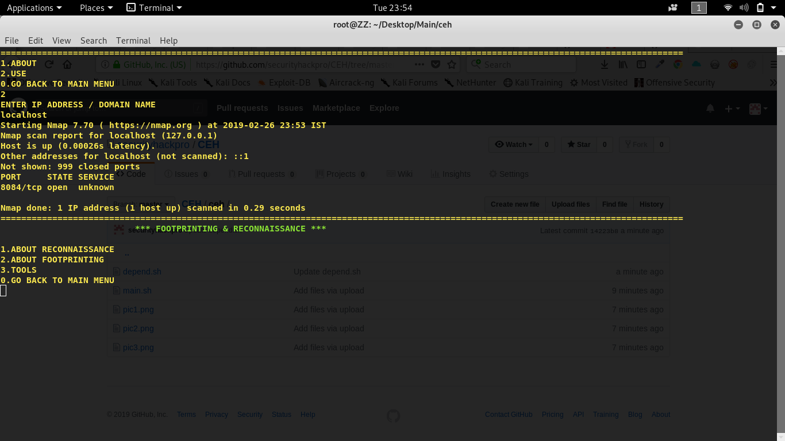

# CEH

securityhacpro@root:~# chmod +x depend.sh

securityhacpro@root:~# ./depend.sh

securityhacpro@root:~# ceh

First change mode of depend.sh file to make executable 

Second run the depend.sh file 

Third now everything is ready you can open over tool from anywhere(any directory) using ceh command.

About : 

Tool is for all those individual who wanted to learn about ceh(Certified Ethical Hacker) exam it has all 18 modules of exam with 
all the important information and links related to particular module and divided preinstalled kali linux tool according to every modules. Where you can learn about each tools and use it in two manner predefined way (for better understanding and easy way) and 
user defined way.

Use : 

Look for tools are installed or not if not it will automatically installed tool.

Interface of our tool with all modules of ceh.

After selecting module of your choice you will get option to learn about that module one options for tools of particular module. 

You will get some informationa about module and important links.

If selecting tool option you will get list of all tools of that particular module.

After selecting tool of your choice you can learn about that tool or use it.

Some information about selected tool.

Two way of using tool predefined(more useful for newbies) or userdefined way.

In predefined way you will get some options like this(this is just an example for nmap tool like this all other tools are also provided user freindly options or in some tools like in nmap -sI parameter is already added for TCP Full Scan).

Thank you.

By securityhackpro team :)
